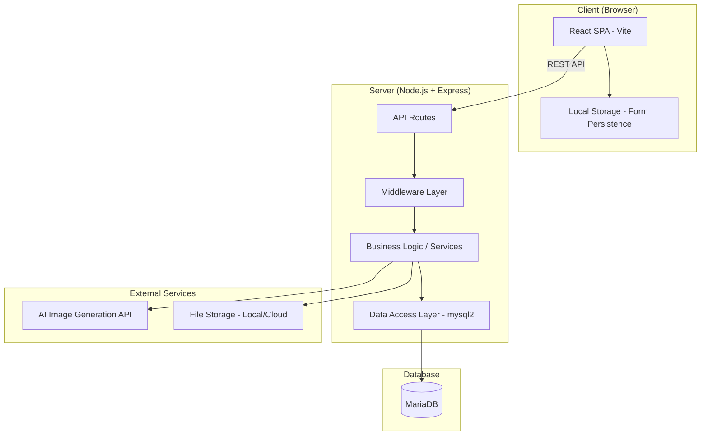
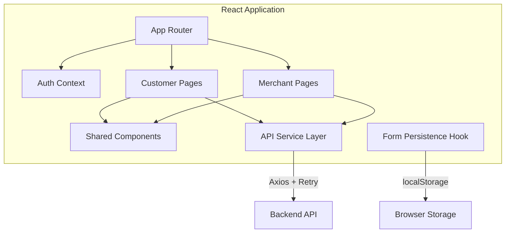
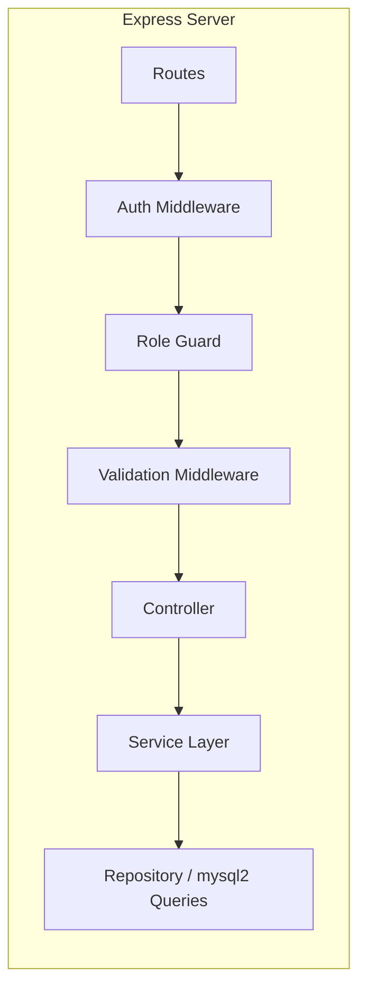
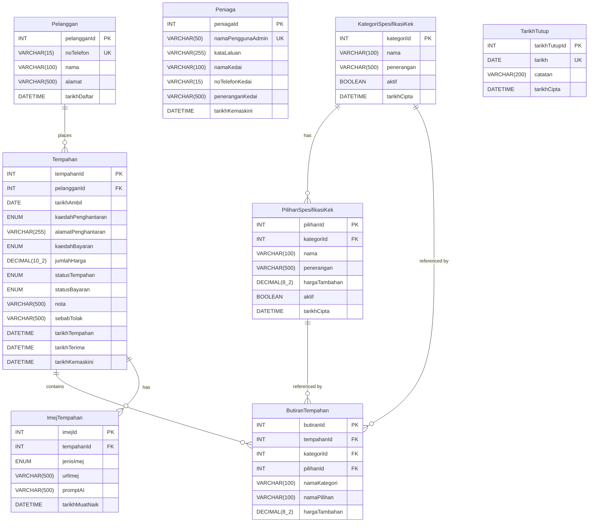

# Design Document: MyKek Cake Ordering System

## Overview

MyKek is a web-based cake ordering system for Zuraida Patisserie, a small bakery in rural Sarawak, Malaysia. The system provides two distinct interfaces:

1. **Customer Portal** — Allows customers to register, log in, place customized cake orders with AI-generated or uploaded reference images, track order status, and manage their profiles.
2. **Merchant Dashboard** — Allows the business owner to manage incoming orders, update production and payment statuses, configure cake specifications and pricing, set unavailability dates, generate sales reports, and manage business information.

Key design considerations:
- **Bahasa Melayu interface** — All user-facing text, labels, and messages are in Bahasa Melayu
- **Rural connectivity** — Offline resilience with local storage persistence and retry mechanisms
- **Simple authentication** — Phone-number-based login for customers, username/password for merchant
- **AI integration** — External AI image generation service for cake design visualization

### Technology Stack

| Layer | Technology |
|-------|-----------|
| Frontend | Vite + React (JSX) |
| UI Library | Tailwind CSS |
| State Management | React Context + useReducer |
| HTTP Client | Axios with interceptors |
| Charts | Chart.js (via react-chartjs-2) |
| PDF Generation | jsPDF + html2canvas |
| Backend | Node.js + Express.js |
| Database | MariaDB |
| ORM | mysql2 (raw parameterized queries) |
| Authentication | express-session + bcrypt |
| File Upload | Multer |
| AI Image | External AI API (e.g., OpenAI DALL-E or Stability AI) |

## Architecture

The system follows a **three-tier architecture** with clear separation between presentation, business logic, and data layers.



### Frontend Architecture



### Backend Architecture



### Key Architectural Decisions

1. **Session-based authentication** over JWT — Simpler for a single-server deployment, easier session invalidation, suitable for the scale of this application.
2. **Server-side sessions with express-session** — Sessions stored in MariaDB via `express-mysql-session` for persistence across server restarts.
3. **Raw mysql2 queries** over a query builder or ORM — Direct SQL with parameterized queries provides full control, prevents SQL injection, and avoids abstraction overhead for this project size.
4. **Local file storage** for uploaded images — Suitable for single-server deployment; images served via Express static middleware.
5. **Axios interceptors** for retry logic — Handles offline resilience with automatic retry on network failures.
6. **React Router** for SPA routing — Separate route groups for customer (`/pelanggan/*`) and merchant (`/peniaga/*`) interfaces.

## Components and Interfaces

### Frontend Components

#### Shared Components

| Component | Purpose |
|-----------|---------|
| `<ProtectedRoute>` | Route guard checking authentication and role |
| `<LoadingSpinner>` | Loading indicator during API calls |
| `<ErrorMessage>` | Standardized error display |
| `<SuccessMessage>` | Standardized success notification |
| `<FormInput>` | Reusable form input with validation |
| `<ImagePreview>` | Image display with loading state |
| `<Pagination>` | Paginated list navigation |
| `<ConfirmDialog>` | Confirmation modal (e.g., cancel order) |

#### Customer Components

| Component | Purpose |
|-----------|---------|
| `<RegisterForm>` | Customer registration with phone validation |
| `<LoginForm>` | Phone-number login |
| `<ProfileForm>` | Profile editing (name, address) |
| `<OrderForm>` | Cake order placement with spec selection |
| `<CakeSpecSelector>` | Dynamic spec category/option picker |
| `<PriceCalculator>` | Real-time price display |
| `<AIImageGenerator>` | Text-to-image generation interface |
| `<ImageUploader>` | Reference image upload |
| `<OrderList>` | Customer's order history |
| `<OrderDetail>` | Full order details with status |
| `<CancelOrderButton>` | Conditional cancel with confirmation |
| `<QRPaymentPage>` | Displays QR code for payment with "Sudah Bayar" button, redirects to order status |

#### Merchant Components

| Component | Purpose |
|-----------|---------|
| `<MerchantLoginForm>` | Username/password login |
| `<OrderManagement>` | Paginated order list with filters |
| `<OrderActions>` | Accept/reject/advance status controls |
| `<PaymentStatusControl>` | Payment status dropdown |
| `<SpecCategoryManager>` | CRUD for cake spec categories |
| `<SpecOptionManager>` | CRUD for cake spec options |
| `<UnavailabilityCalendar>` | Calendar view for closed dates |
| `<SalesReport>` | Charts and report display |
| `<ReportDownload>` | PDF export button |
| `<BusinessInfoForm>` | Business details editing |

### Backend API Endpoints

#### Authentication

| Method | Endpoint | Description |
|--------|----------|-------------|
| POST | `/api/auth/pelanggan/daftar` | Customer registration |
| POST | `/api/auth/pelanggan/log-masuk` | Customer login |
| POST | `/api/auth/pelanggan/log-keluar` | Customer logout |
| POST | `/api/auth/peniaga/log-masuk` | Merchant login |
| POST | `/api/auth/peniaga/log-keluar` | Merchant logout |

#### Customer APIs

| Method | Endpoint | Description |
|--------|----------|-------------|
| GET | `/api/pelanggan/profil` | Get customer profile |
| PUT | `/api/pelanggan/profil` | Update customer profile |
| GET | `/api/pelanggan/tempahan` | List customer orders |
| GET | `/api/pelanggan/tempahan/:id` | Get order details |
| POST | `/api/pelanggan/tempahan` | Place new order |
| PUT | `/api/pelanggan/tempahan/:id/batal` | Cancel order |
| POST | `/api/pelanggan/tempahan/jana-imej` | Generate AI image |
| POST | `/api/pelanggan/tempahan/muat-naik-imej` | Upload reference image |
| GET | `/api/pelanggan/spesifikasi-kek` | Get active cake specs |
| GET | `/api/pelanggan/tarikh-tutup` | Get closed dates |

#### Merchant APIs

| Method | Endpoint | Description |
|--------|----------|-------------|
| GET | `/api/peniaga/tempahan` | List all orders (paginated, filterable) |
| GET | `/api/peniaga/tempahan/:id` | Get order details |
| PUT | `/api/peniaga/tempahan/:id/terima` | Accept order |
| PUT | `/api/peniaga/tempahan/:id/tolak` | Reject order |
| PUT | `/api/peniaga/tempahan/:id/status` | Advance order status |
| PUT | `/api/peniaga/tempahan/:id/status-bayaran` | Update payment status |
| GET | `/api/peniaga/kategori-spesifikasi` | List spec categories |
| POST | `/api/peniaga/kategori-spesifikasi` | Create spec category |
| PUT | `/api/peniaga/kategori-spesifikasi/:id` | Update spec category |
| DELETE | `/api/peniaga/kategori-spesifikasi/:id` | Delete spec category |
| GET | `/api/peniaga/pilihan-spesifikasi/:kategoriId` | List spec options |
| POST | `/api/peniaga/pilihan-spesifikasi` | Create spec option |
| PUT | `/api/peniaga/pilihan-spesifikasi/:id` | Update spec option |
| DELETE | `/api/peniaga/pilihan-spesifikasi/:id` | Delete spec option |
| GET | `/api/peniaga/tarikh-tutup` | List closed dates |
| POST | `/api/peniaga/tarikh-tutup` | Add closed date |
| DELETE | `/api/peniaga/tarikh-tutup/:id` | Remove closed date |
| GET | `/api/peniaga/laporan-jualan` | Get sales report data |
| GET | `/api/peniaga/profil-perniagaan` | Get business info |
| PUT | `/api/peniaga/profil-perniagaan` | Update business info |

#### Public APIs

| Method | Endpoint | Description |
|--------|----------|-------------|
| GET | `/api/awam/profil-kedai` | Get public shop info |

### Service Layer Interfaces

```javascript
// AuthService
authService.registerCustomer({ noTelefon, nama }) → { pelangganId }
authService.loginCustomer({ noTelefon }) → { session }
authService.loginMerchant({ namaPenggunaAdmin, kataLaluan }) → { session }
authService.checkLoginAttempts(username) → { locked, remainingMinutes }

// OrderService
orderService.createOrder({ pelangganId, butiran, tarikhAmbil, kaedahPenghantaran, alamatPenghantaran, kaedahBayaran, nota }) → { tempahanId }
orderService.cancelOrder(tempahanId, pelangganId) → { success }
orderService.acceptOrder(tempahanId) → { success }
orderService.rejectOrder(tempahanId, sebab) → { success }
orderService.advanceStatus(tempahanId) → { newStatus }
orderService.updatePaymentStatus(tempahanId, statusBayaran) → { success }
orderService.calculateTotal(selectedOptions[]) → { jumlahHarga }

// CakeSpecService
cakeSpecService.getActiveCategories() → { categories[] }
cakeSpecService.createCategory({ nama, penerangan }) → { kategoriId }
cakeSpecService.createOption({ kategoriId, nama, penerangan, hargaTambahan }) → { pilihanId }
cakeSpecService.deleteCategory(kategoriId) → { success }
cakeSpecService.deleteOption(pilihanId) → { success }

// ImageService
imageService.generateAIImage(prompt) → { imageUrl }
imageService.uploadImage(file, tempahanId) → { imageUrl }

// ReportService
reportService.getSalesReport(bulan, tahun) → { totalOrders, totalRevenue, statusBreakdown, paymentBreakdown }
reportService.generatePDF(reportData) → { pdfBuffer }

// ClosedDateService
closedDateService.addClosedDate({ tarikh, catatan }) → { tarikhTutupId }
closedDateService.removeClosedDate(tarikhTutupId) → { success }
closedDateService.isDateClosed(tarikh) → { closed }
```

## Data Models

### Database Schema (MariaDB)



### Enum Definitions

```sql
-- Order Status
ENUM('Menunggu Pengesahan', 'Diterima', 'Ditolak', 'Dibatalkan', 'Sedang Diproses', 'Sedang Dihias', 'Sedia untuk Diambil/Dihantar', 'Selesai')

-- Payment Status
ENUM('Belum Dibayar', 'Deposit Dibayar', 'Telah Dibayar')

-- Delivery Method
ENUM('Ambil Sendiri', 'Penghantaran')

-- Payment Method
ENUM('QR Code')

-- Image Type
ENUM('AI', 'Muat Naik')
```

### Data Design Decisions

1. **Denormalized order details (ButiranTempahan)** — Stores `namaKategori`, `namaPilihan`, and `hargaTambahan` directly in order details. This preserves historical accuracy when categories/options are later edited or soft-deleted.

2. **Soft delete for specifications** — `aktif` boolean flag on `KategoriSpesifikasiKek` and `PilihanSpesifikasiKek` instead of physical deletion. Existing orders retain references to inactive specs.

3. **Session storage in MariaDB** — Using `express-mysql-session` to store sessions in the database, enabling session persistence across server restarts and supporting the inactivity timeout requirements.

4. **Image storage** — Images stored on the local filesystem under `/uploads/images/` with the URL path stored in the database. The `jenisImej` field distinguishes AI-generated from uploaded images.

5. **Acceptance timestamp** — `tarikhTerima` on `Tempahan` records when an order is accepted, enabling the 24-hour cancellation window calculation.

## Correctness Properties

*A property is a characteristic or behavior that should hold true across all valid executions of a system — essentially, a formal statement about what the system should do. Properties serve as the bridge between human-readable specifications and machine-verifiable correctness guarantees.*

### Property 1: Phone number validation determines registration outcome

*For any* string input as a phone number, registration SHALL succeed if and only if the string is 10-11 digits starting with "01" and is not already registered, and the name is 1-100 characters. All other inputs SHALL be rejected with an appropriate error.

**Validates: Requirements 1.1, 1.2, 1.3**

### Property 2: Customer login validation

*For any* phone number input, login SHALL succeed if and only if the phone number exists in the Pelanggan table and matches valid format (numeric, 10-11 digits starting with "01"). Unregistered or invalid-format numbers SHALL be rejected.

**Validates: Requirements 2.1, 2.2, 2.3**

### Property 3: Profile data validation

*For any* profile update input, the update SHALL succeed if and only if the name is between 2 and 100 characters and the address is at most 500 characters. All inputs outside these constraints SHALL be rejected without modifying the stored data.

**Validates: Requirements 3.1, 3.3**

### Property 4: Only active specifications appear in order form

*For any* set of Cake_Spec_Categories and Cake_Spec_Options in the database, the order form SHALL display only those with `aktif = true`. Inactive (soft-deleted) categories and options SHALL never appear.

**Validates: Requirements 4.1**

### Property 5: Order total price equals sum of selected option prices

*For any* set of selected Cake_Spec_Options, the calculated `jumlahHarga` SHALL equal the arithmetic sum of all `hargaTambahan` values from the selected options.

**Validates: Requirements 4.4**

### Property 6: Order creation validation

*For any* order submission, the order SHALL be created with status "Menunggu Pengesahan" if and only if: all required Cake_Spec_Categories have a selected option, a pickup/delivery date is provided that is not a Closed_Date and is at least 2 days in the future, a delivery method is selected, a payment method is selected, and if delivery method is "Penghantaran" then a non-empty address (≤255 chars) is provided. All other submissions SHALL be rejected.

**Validates: Requirements 4.2, 4.3, 4.5, 4.7**

### Property 7: AI image description length validation

*For any* text input submitted for AI image generation, the request SHALL be sent to the AI service if and only if the description is between 10 and 500 characters (inclusive). Inputs outside this range SHALL be rejected without calling the external service.

**Validates: Requirements 5.2**

### Property 8: Image upload validation

*For any* file uploaded as a reference image, the upload SHALL succeed if and only if the file format is JPEG or PNG and the file size is at most 5MB. Files that violate either constraint SHALL be rejected.

**Validates: Requirements 6.2**

### Property 9: Image replacement invariant

*For any* order, after uploading a new reference image, the order SHALL have exactly one associated Order_Image of type "Muat Naik", regardless of how many uploads have been performed.

**Validates: Requirements 6.4**

### Property 10: Customer order list sorting invariant

*For any* customer with multiple orders, the order list SHALL always be sorted by `tarikhTempahan` in descending order (most recent first).

**Validates: Requirements 7.1**

### Property 11: Order cancellation eligibility

*For any* order, the cancellation action SHALL be available if and only if the order status is "Menunggu Pengesahan" OR (the order status is "Diterima" AND the current time is within 24 hours of `tarikhTerima`). For all other states, cancellation SHALL be unavailable. When cancellation is confirmed, the status SHALL become "Dibatalkan".

**Validates: Requirements 8.1, 8.2, 8.4, 8.5**

### Property 12: Merchant account lockout after failed attempts

*For any* merchant username, after 5 consecutive failed login attempts, the account SHALL be locked for 15 minutes. During the lockout period, even correct credentials SHALL be rejected.

**Validates: Requirements 9.4**

### Property 13: Order status state machine — forward-only single-step transitions

*For any* order in a production phase, the status SHALL only advance to the immediate next phase in the fixed sequence: Diterima → Sedang Diproses → Sedang Dihias → Sedia untuk Diambil/Dihantar → Selesai. Skipping phases, reverting to previous phases, or advancing past "Selesai" SHALL be rejected.

**Validates: Requirements 11.1, 11.4**

### Property 14: Payment status update constraints

*For any* order, payment status update SHALL succeed if and only if the order status is NOT "Dibatalkan" or "Ditolak", AND the new payment status is one of: "Belum Dibayar", "Deposit Dibayar", or "Telah Dibayar".

**Validates: Requirements 12.1, 12.3, 12.4**

### Property 15: Cake specification CRUD validation

*For any* cake specification category or option creation/update, the operation SHALL succeed if and only if: the name is 1-100 characters, the name is unique within its scope (category names globally unique among active categories, option names unique within the same category), and for options the `hargaTambahan` is between RM 0.00 and RM 9999.99. Invalid inputs SHALL be rejected.

**Validates: Requirements 13.1, 13.2, 13.7**

### Property 16: Soft-deleted specifications preserved in historical orders

*For any* order that references a Cake_Spec_Category or Cake_Spec_Option that is subsequently soft-deleted, the order's `ButiranTempahan` records SHALL still contain the original `namaKategori`, `namaPilihan`, and `hargaTambahan` values.

**Validates: Requirements 13.6**

### Property 17: Closed date round-trip

*For any* future date, adding it as a Closed_Date SHALL cause it to appear in the blocked dates list for customers, and removing it SHALL cause it to no longer appear. Adding a past date or a date already marked as closed SHALL be rejected.

**Validates: Requirements 14.1, 14.2, 14.4, 14.6**

### Property 18: Sales report aggregation accuracy

*For any* month and year with orders, the sales report SHALL return a `totalOrders` equal to the count of orders in that period, `totalRevenue` equal to the sum of `jumlahHarga` for completed/accepted orders, and status/payment breakdowns that sum to the total order count.

**Validates: Requirements 15.1**

### Property 19: Role-based access control

*For any* API endpoint, access SHALL be granted if and only if the requester has an authenticated session with the correct role (Customer for customer endpoints, Merchant for merchant endpoints). Unauthenticated requests and cross-role requests SHALL be denied.

**Validates: Requirements 18.1, 18.2, 18.5**

### Property 20: Password storage irreversibility

*For any* merchant password, the stored value SHALL be a bcrypt hash such that the original plaintext cannot be derived from it, and `bcrypt.compare(plaintext, hash)` returns true only for the correct password.

**Validates: Requirements 18.3**

### Property 21: Form data persistence round-trip

*For any* form input data entered by a customer in the order form, the data SHALL be saved to localStorage within 2 seconds of input change, and upon page reload the saved data SHALL be restored to the corresponding form fields with identical values.

**Validates: Requirements 19.2, 19.3**

## Error Handling

### Frontend Error Handling Strategy

| Scenario | Handling |
|----------|----------|
| Network timeout / connection lost | Display connectivity error after 3 retries (3s intervals). Preserve form data in localStorage. Show retry button. |
| API returns 4xx validation error | Parse error response, display field-specific error messages in Bahasa Melayu next to the relevant form fields. |
| API returns 401 Unauthorized | Redirect to appropriate login page (customer or merchant). Clear session state. |
| API returns 403 Forbidden | Redirect to user's own dashboard with access denied message. |
| API returns 500 Server Error | Display generic "Ralat sistem. Sila cuba lagi." (System error. Please try again.) message. |
| File upload failure | Display error message, preserve file selection, show retry option. |
| AI image generation failure | Display "Perkhidmatan tidak tersedia" message, offer upload alternative. |
| Session expired | Redirect to login with "Sesi anda telah tamat" message. |

### Backend Error Handling Strategy

| Layer | Handling |
|-------|----------|
| Validation Middleware | Return 400 with structured error object: `{ ralat: true, mesej: "...", medan: "fieldName" }` |
| Authentication Middleware | Return 401 with `{ ralat: true, mesej: "Sila log masuk" }` |
| Authorization Middleware | Return 403 with `{ ralat: true, mesej: "Akses ditolak" }` |
| Service Layer | Catch business logic errors, return appropriate 4xx status with descriptive message |
| Database Layer | Catch constraint violations (duplicate key, foreign key), map to user-friendly messages |
| Unhandled Errors | Global error handler returns 500, logs full error server-side, returns generic message to client |

### Error Response Format

```json
{
  "ralat": true,
  "mesej": "Nombor telefon sudah didaftarkan",
  "medan": "noTelefon",
  "kod": "PENDAFTARAN_DUPLIKAT"
}
```

### Retry and Resilience

- **Axios interceptor** implements automatic retry for network errors (not for 4xx/5xx responses)
- Maximum 3 retries with 3-second delay between attempts
- Exponential backoff not required given the rural connectivity context (consistent retry interval is simpler)
- Form data auto-saved to localStorage on every input change (debounced at 2 seconds)
- localStorage data expires after 24 hours (timestamp-based expiry check)

## Testing Strategy

### Testing Framework

| Layer | Framework | Purpose |
|-------|-----------|---------|
| Unit Tests | Vitest | Service logic, validation, utilities |
| Property Tests | fast-check (via Vitest) | Universal properties, input validation, state machines |
| Integration Tests | Vitest + Supertest | API endpoint testing with database |
| E2E Tests | Playwright | Full user flow testing |

### Property-Based Testing Configuration

- **Library**: fast-check (JavaScript property-based testing library)
- **Runner**: Vitest
- **Minimum iterations**: 100 per property test
- **Tag format**: `Feature: mykek-cake-ordering-system, Property {number}: {property_text}`

Each correctness property from the design document maps to a single property-based test using fast-check arbitraries to generate random valid and invalid inputs.

### Test Categories

#### Unit Tests (Vitest)
- Input validation functions (phone format, name length, price range)
- Price calculation logic
- Date availability checking
- Order status transition logic
- Session timeout logic
- Error message formatting

#### Property-Based Tests (fast-check + Vitest)
- Phone number validation (Property 1, 2)
- Profile validation (Property 3)
- Active spec filtering (Property 4)
- Price calculation (Property 5)
- Order validation (Property 6)
- AI description validation (Property 7)
- File upload validation (Property 8)
- Image replacement invariant (Property 9)
- Order sorting (Property 10)
- Cancellation eligibility (Property 11)
- Account lockout (Property 12)
- Status state machine (Property 13)
- Payment status constraints (Property 14)
- Spec CRUD validation (Property 15)
- Historical data preservation (Property 16)
- Closed date management (Property 17)
- Sales aggregation (Property 18)
- Access control (Property 19)
- Password hashing (Property 20)
- Form persistence round-trip (Property 21)

#### Integration Tests (Vitest + Supertest)
- Full API endpoint testing with MariaDB test database
- Session management flows
- File upload/download
- AI service integration (mocked)
- Cross-role access denial

#### E2E Tests (Playwright)
- Customer registration and login flow
- Complete order placement flow
- Order cancellation flow
- Merchant order management flow
- Cake specification CRUD flow
- Sales report generation and PDF download

