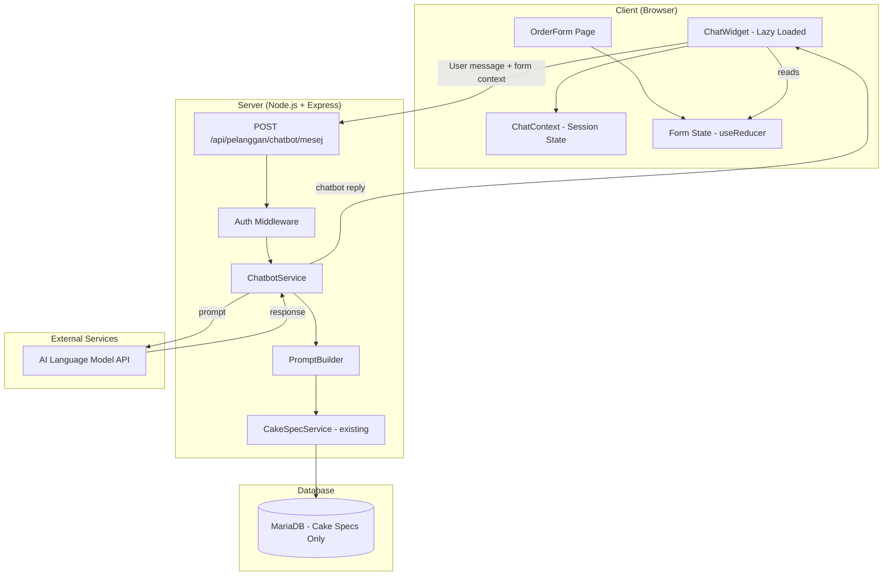
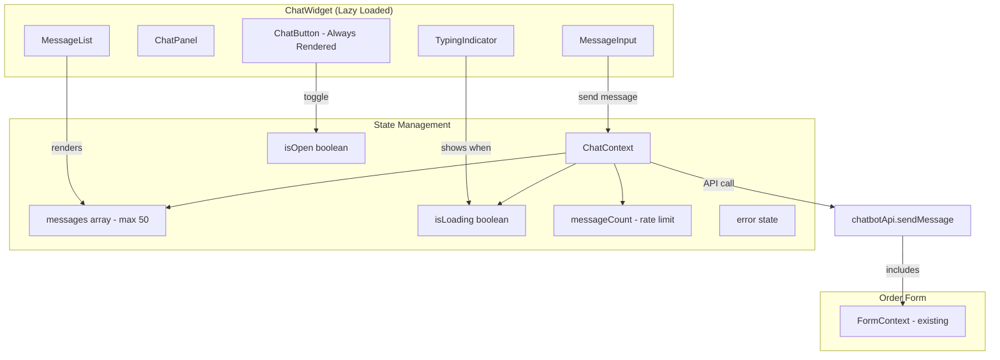
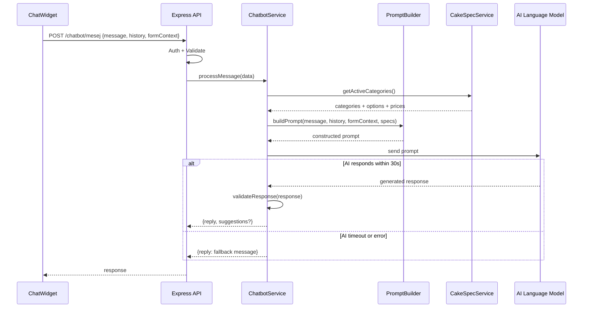

# Design Document: Order Form Chatbot

## Overview

The Order Form Chatbot (Pembantu Pesanan) is an AI-powered conversational assistant embedded in the MyKek cake ordering system's order form page. It helps customers navigate the cake ordering process by answering questions about available cake specifications, guiding form completion, explaining options and pricing, and suggesting cake designs based on occasions or preferences.

### Key Design Decisions

1. **Lazy-loaded chat widget** — The chatbot component is code-split and loaded only when the customer clicks the chat button, adding zero bytes to the initial page bundle.
2. **Session-scoped conversation** — Chat messages are stored only in frontend state (React Context) for the duration of the session. No messages are persisted to the database.
3. **Backend prompt construction** — The backend assembles a prompt combining the customer's message, session history, form context, and active cake specifications before sending to the AI language model API.
4. **Form context synchronization** — The chatbot reads the current form state on each message send, ensuring responses always reflect the latest selections even when the customer modifies the form directly.
5. **Rate limiting per session** — A maximum of 20 messages per session prevents excessive API usage while still providing meaningful assistance.

### Technology Additions

| Layer | Technology | Purpose |
|-------|-----------|---------|
| Frontend | React.lazy + Suspense | Lazy-loading chatbot component |
| Frontend | React Context (ChatContext) | Chat session state management |
| Backend | New Express route `/api/pelanggan/chatbot` | Chatbot message endpoint |
| Backend | AI Language Model API (e.g., OpenAI Chat Completions) | Response generation |

## Architecture

The chatbot integrates into the existing three-tier architecture as a new vertical slice spanning frontend, backend, and external AI service.



### Frontend Chat Architecture



### Backend Message Flow



## Components and Interfaces

### Frontend Components

| Component | Purpose |
|-----------|---------|
| `<ChatButton>` | Floating button (bottom-right, 48x48px min touch target) to toggle chat panel |
| `<ChatPanel>` | Container for the chat interface (max 380x500px, full-screen on mobile <480px) |
| `<MessageList>` | Scrollable list of chat messages with auto-scroll to bottom |
| `<ChatMessage>` | Individual message bubble with sender distinction (customer right-aligned, bot left-aligned) |
| `<MessageInput>` | Text input (max 500 chars) with send button, Enter key support |
| `<TypingIndicator>` | Animated dots shown while waiting for bot response |
| `<SuggestionCard>` | Displays a cake suggestion with options and "Apply" button |
| `<RetryButton>` | Retry connection button shown during service unavailability |
| `<ChatErrorMessage>` | Error/fallback message display within chat |

### ChatContext Interface

```javascript
// ChatContext state
{
  messages: ChatMessage[],       // max 50 messages
  isOpen: boolean,               // panel open/closed
  isLoading: boolean,            // waiting for response
  messageCount: number,          // messages sent this session (max 20)
  error: string | null,          // current error state
  isDisabled: boolean,           // input disabled (rate limit or error)
}

// ChatMessage type
{
  id: string,                    // unique message ID
  sender: 'customer' | 'bot',   // message sender
  content: string,              // message text
  timestamp: Date,              // when message was created
  suggestions?: Suggestion[],   // optional cake suggestions (bot only)
}

// Suggestion type
{
  id: string,
  description: string,          // max 200 chars explanation
  options: {
    kategoriId: number,
    kategoriNama: string,
    pilihanId: number,
    pilihanNama: string,
    hargaTambahan: number,
  }[],
}
```

### Backend API Endpoint

| Method | Endpoint | Description |
|--------|----------|-------------|
| POST | `/api/pelanggan/chatbot/mesej` | Send a customer message and receive chatbot response |

#### Request Body

```json
{
  "mesej": "Apa saiz kek yang ada?",
  "sejarah": [
    { "peranan": "customer", "kandungan": "Hai" },
    { "peranan": "bot", "kandungan": "Hai! Saya Pembantu Pesanan..." }
  ],
  "konteksBoring": {
    "pilihanDipilih": [
      { "kategoriId": 1, "pilihanId": 3 }
    ],
    "kaedahPenghantaran": "Ambil Sendiri",
    "tarikhAmbil": "2025-02-15",
    "jumlahHarga": 85.00,
    "medanKosong": ["tema", "nota"]
  }
}
```

#### Response Body

```json
{
  "balasan": "Kami ada 3 saiz kek:\n1. 1kg - RM 0.00 (tambahan)\n2. 1.5kg - RM 15.00\n3. 2kg - RM 30.00",
  "cadangan": null,
  "tindakan": null
}
```

#### Response with Form Action

```json
{
  "balasan": "Baik, saya dah pilihkan saiz 2kg untuk anda. Harga tambahan RM 30.00.",
  "cadangan": null,
  "tindakan": {
    "jenis": "pilih_opsyen",
    "kategoriId": 1,
    "pilihanId": 5
  }
}
```

#### Response with Suggestions

```json
{
  "balasan": "Untuk hari jadi anak 5 tahun, saya cadangkan:",
  "cadangan": [
    {
      "id": "sug-1",
      "penerangan": "Kek coklat tema kartun sesuai untuk kanak-kanak",
      "pilihan": [
        { "kategoriId": 1, "pilihanId": 3, "kategoriNama": "Saiz", "pilihanNama": "1.5kg", "hargaTambahan": 15.00 },
        { "kategoriId": 2, "pilihanId": 7, "kategoriNama": "Perisa", "pilihanNama": "Coklat", "hargaTambahan": 0.00 },
        { "kategoriId": 3, "pilihanId": 12, "kategoriNama": "Tema", "pilihanNama": "Kartun", "hargaTambahan": 20.00 }
      ]
    }
  ],
  "tindakan": null
}
```

### Service Layer Interfaces

```javascript
// ChatbotService
chatbotService.processMessage({
  mesej: string,                    // customer message (1-500 chars)
  sejarah: HistoryMessage[],        // last 10 messages
  konteksBoring: FormContext,       // current form state
  pelangganId: number               // authenticated customer ID
}) → { balasan: string, cadangan?: Suggestion[], tindakan?: FormAction }

// PromptBuilder
promptBuilder.buildPrompt({
  mesej: string,
  sejarah: HistoryMessage[],
  konteksBoring: FormContext,
  spesifikasiKek: CakeSpec[],       // active categories + options
}) → string                          // constructed prompt for AI

// Response Validator
responseValidator.validate(aiResponse: string) → {
  isValid: boolean,                  // true if response is on-topic
  sanitized: string                  // cleaned response text
}
```

### PromptBuilder — System Prompt Structure

The system prompt instructs the AI model with:
1. Role definition (Pembantu Pesanan for MyKek)
2. Language constraint (respond only in Bahasa Melayu)
3. Tone guidelines (informal, "anda", max 25 words per sentence, max 300 words total)
4. Topic restriction (cake ordering, specs, pricing, delivery only)
5. Available cake specifications with prices (injected dynamically)
6. Current form state (injected dynamically)
7. Instructions for form actions (JSON format for selecting options)
8. Instructions for suggestions (JSON format for cake recommendations)

## Data Models

The chatbot does not introduce new database tables. It reads from existing tables and keeps all chat state in-memory (frontend React state).

### Data Read from Existing Tables

| Table | Data Used |
|-------|-----------|
| `KategoriSpesifikasiKek` | Active category names and descriptions |
| `PilihanSpesifikasiKek` | Active option names, descriptions, and prices per category |
| `TarikhTutup` | Closed dates for delivery date guidance |

### Frontend State Model (In-Memory Only)

```javascript
/**
 * @typedef {Object} ChatSession
 * @property {ChatMessage[]} messages - max 50, FIFO when exceeded
 * @property {number} messageCount - customer messages sent (max 20)
 * @property {boolean} isOpen
 * @property {boolean} isLoading
 * @property {string|null} error
 * @property {boolean} isDisabled
 */

/**
 * @typedef {Object} ChatMessage
 * @property {string} id
 * @property {'customer'|'bot'} sender
 * @property {string} content
 * @property {Date} timestamp
 * @property {Suggestion[]} [suggestions]
 */

/**
 * @typedef {Object} Suggestion
 * @property {string} id
 * @property {string} penerangan - max 200 chars
 * @property {SuggestionOption[]} pilihan
 */

/**
 * @typedef {Object} SuggestionOption
 * @property {number} kategoriId
 * @property {number} pilihanId
 * @property {string} kategoriNama
 * @property {string} pilihanNama
 * @property {number} hargaTambahan
 */

/**
 * @typedef {Object} FormAction
 * @property {'pilih_opsyen'} jenis
 * @property {number} kategoriId
 * @property {number} pilihanId
 */

/**
 * @typedef {Object} FormContext
 * @property {{kategoriId: number, pilihanId: number}[]} pilihanDipilih
 * @property {string|null} kaedahPenghantaran
 * @property {string|null} tarikhAmbil
 * @property {number} jumlahHarga
 * @property {string[]} medanKosong
 */
```

### Request Validation Schema

```javascript
// POST /api/pelanggan/chatbot/mesej validation
{
  mesej: string,          // required, 1-500 characters
  sejarah: array,         // required, max 10 items
    each: {
      peranan: enum('customer', 'bot'),
      kandungan: string   // 1-500 characters
    },
  konteksBoring: object,  // required
    pilihanDipilih: array,
    kaedahPenghantaran: string | null,
    tarikhAmbil: string | null,
    jumlahHarga: number,
    medanKosong: array of strings
}
```

## Correctness Properties

*A property is a characteristic or behavior that should hold true across all valid executions of a system — essentially, a formal statement about what the system should do. Properties serve as the bridge between human-readable specifications and machine-verifiable correctness guarantees.*

### Property 1: Message validation determines submission outcome

*For any* string input, message submission SHALL succeed if and only if the string length is between 1 and 500 characters (inclusive). Empty strings, whitespace-only strings of length 0, and strings exceeding 500 characters SHALL be rejected without sending to the backend.

**Validates: Requirements 2.1, 2.4**

### Property 2: Message history maintains chronological order and 50-message cap with FIFO eviction

*For any* sequence of N messages added to the chat session, the messages array SHALL always be in chronological order (oldest first), SHALL never exceed 50 messages, and when N > 50, SHALL contain exactly the most recent 50 messages with the oldest messages evicted first.

**Validates: Requirements 2.5, 6.4, 6.5**

### Property 3: Toggle open/close preserves conversation history

*For any* chat session with messages, toggling the chat panel closed and then open again SHALL preserve all messages in the session — the messages array before close SHALL be identical to the messages array after reopen.

**Validates: Requirements 1.4**

### Property 4: Prompt construction includes all required context

*For any* valid combination of (customer message, session history of up to 10 messages, form context, and active cake specifications), the constructed prompt SHALL contain: the customer's message text, all history messages in order, all form context fields (selected options, delivery method, date, total price, empty fields), and all active cake spec categories with their option names, descriptions, and prices.

**Validates: Requirements 3.1, 4.2, 6.1, 9.1**

### Property 5: Form action correctly updates form state

*For any* valid form action specifying a (kategoriId, pilihanId) pair, applying the action to the form state SHALL result in that category having the specified option selected, regardless of whether the category previously had a different selection or no selection.

**Validates: Requirements 4.1, 4.8**

### Property 6: Suggestions only reference active cake spec options

*For any* suggestion returned by the chatbot, every (kategoriId, pilihanId) pair in the suggestion SHALL reference an option that exists in the database with `aktif = true`. Suggestions containing inactive or non-existent options SHALL be filtered out before being presented to the customer.

**Validates: Requirements 5.2**

### Property 7: Applying a suggestion updates all referenced form fields and calculates correct price impact

*For any* valid suggestion containing N option selections, applying the suggestion to the form state SHALL update exactly those N category fields with the specified options, and the total price impact SHALL equal the arithmetic sum of all `hargaTambahan` values from the suggestion's options.

**Validates: Requirements 5.3**

### Property 8: Response word count does not exceed 300 words

*For any* AI-generated response string, the response validator SHALL ensure the final response contains at most 300 words. Responses exceeding this limit SHALL be truncated to 300 words.

**Validates: Requirements 7.3**

### Property 9: Rate limiting blocks messages after 20 per session

*For any* chat session, after the customer has successfully sent 20 messages, all subsequent message submission attempts SHALL be rejected and the input field SHALL be disabled for the remainder of the session.

**Validates: Requirements 10.4**

## Error Handling

### Frontend Error Handling

| Scenario | Handling |
|----------|----------|
| Backend returns error (5xx) | Display "Maaf, pembantu pesanan tidak tersedia buat masa ini. Sila cuba lagi sebentar." Disable input. Show retry button. |
| Retry also fails | Keep input disabled, retain retry button, show same unavailability message. |
| Network connection lost | Display connectivity error within 10 seconds. Retain unsent message in input field. Show retry when connection restored. |
| Backend timeout (>15 seconds) | Hide typing indicator. Display timeout message. Allow resend. |
| AI returns low-confidence/unprocessable response | Display fallback: "Maaf, saya tidak faham. Cuba tanya tentang saiz kek, perisa, tema, atau harga." |
| Message validation failure | Prevent submission. Show inline validation: "Mesej mestilah antara 1 hingga 500 aksara." |
| Rate limit exceeded (>20 messages) | Display: "Anda telah mencapai had mesej. Sila lengkapkan borang secara manual atau hubungi kedai." Disable input. |
| Chatbot component fails to lazy-load | Display error on chat button area. Allow retry by clicking button again. |
| Suggestion contains invalid options | Filter out invalid suggestions silently. If all suggestions invalid, return fallback message. |

### Backend Error Handling

| Scenario | Handling |
|----------|----------|
| AI API unavailable | Return predefined fallback response within 5 seconds: `{ balasan: "Maaf, pembantu pesanan tidak tersedia buat masa ini.", cadangan: null, tindakan: null }` |
| AI API timeout (>30 seconds) | Cancel pending request. Return same fallback response. |
| AI returns off-topic response | Replace with: "Saya hanya boleh membantu dengan pesanan kek. Tanya saya tentang saiz, perisa, tema, atau harga." |
| Invalid request body | Return 400 with validation error: `{ ralat: true, mesej: "...", medan: "..." }` |
| Unauthenticated request | Return 401: `{ ralat: true, mesej: "Sila log masuk" }` |
| Database query failure (fetching specs) | Return fallback response indicating temporary unavailability. Log error server-side. |

### Error Response Format

```json
{
  "ralat": true,
  "mesej": "Mesej mestilah antara 1 hingga 500 aksara",
  "medan": "mesej",
  "kod": "PENGESAHAN_GAGAL"
}
```

### Timeout Configuration

| Operation | Timeout | Action on Timeout |
|-----------|---------|-------------------|
| Frontend waiting for backend | 15 seconds | Hide typing indicator, show timeout message |
| Backend waiting for AI API | 30 seconds | Cancel request, return fallback |
| Backend fallback response | 5 seconds | Return predefined message (no external call) |
| Typing indicator display | 1 second | Show within 1 second of sending request |

## Testing Strategy

### Testing Framework

| Layer | Framework | Purpose |
|-------|-----------|---------|
| Unit Tests | Vitest | Service logic, validation, prompt building |
| Property Tests | fast-check (via Vitest) | Universal properties, input validation, state management |
| Integration Tests | Vitest + Supertest | API endpoint testing with mocked AI |
| Component Tests | Vitest + React Testing Library | Frontend component behavior |
| E2E Tests | Playwright | Full chatbot interaction flow |

### Property-Based Testing Configuration

- **Library**: fast-check (JavaScript property-based testing library)
- **Runner**: Vitest
- **Minimum iterations**: 100 per property test
- **Tag format**: `Feature: order-form-chatbot, Property {number}: {property_text}`

Each correctness property from the design document maps to a single property-based test using fast-check arbitraries to generate random valid and invalid inputs.

### Test Categories

#### Unit Tests (Vitest)
- Welcome message content verification
- Chat panel toggle behavior
- Typing indicator state management
- Error message display logic
- Retry button behavior
- Mobile responsive breakpoint logic

#### Property-Based Tests (fast-check + Vitest)
- Message validation — valid/invalid length boundaries (Property 1)
- Message history ordering and FIFO cap (Property 2)
- Toggle preserves messages (Property 3)
- Prompt construction completeness (Property 4)
- Form action application (Property 5)
- Suggestion option validation against active specs (Property 6)
- Suggestion application and price calculation (Property 7)
- Response word count limit (Property 8)
- Rate limiting enforcement (Property 9)

#### Integration Tests (Vitest + Supertest)
- POST `/api/pelanggan/chatbot/mesej` with valid request
- POST `/api/pelanggan/chatbot/mesej` with invalid request body
- Authentication required (401 for unauthenticated)
- AI API timeout handling (30-second timeout)
- AI API error handling (fallback response)
- Off-topic response detection and replacement
- Cake spec data inclusion in prompt

#### Component Tests (React Testing Library)
- ChatButton renders with correct positioning
- ChatPanel opens/closes on button click
- MessageInput enforces 500 character limit
- MessageList auto-scrolls to bottom
- TypingIndicator shows during loading
- SuggestionCard renders and applies suggestions
- RetryButton triggers reconnection
- Mobile overlay at viewport <480px

#### E2E Tests (Playwright)
- Customer opens chat, sends message, receives response
- Customer asks about cake sizes, receives option list
- Customer requests form fill, form updates correctly
- Customer accepts suggestion, form updates with all options
- Rate limit reached after 20 messages
- Network error recovery flow
- Mobile full-screen overlay interaction

