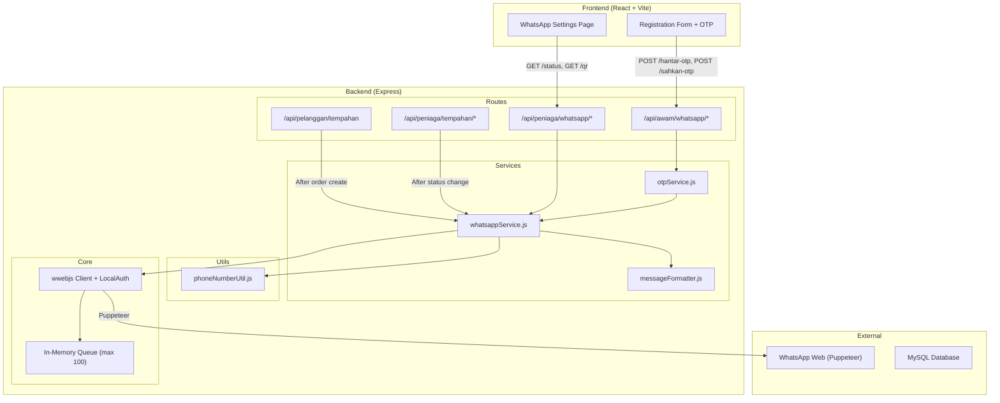
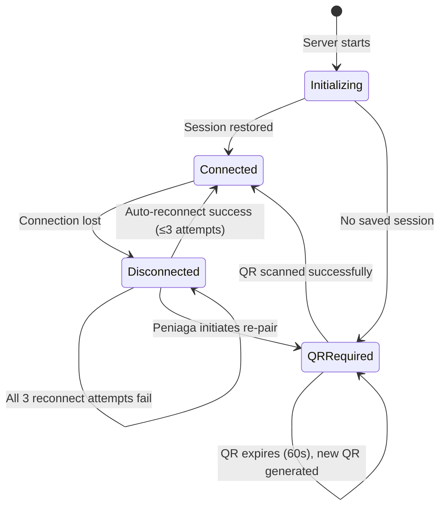
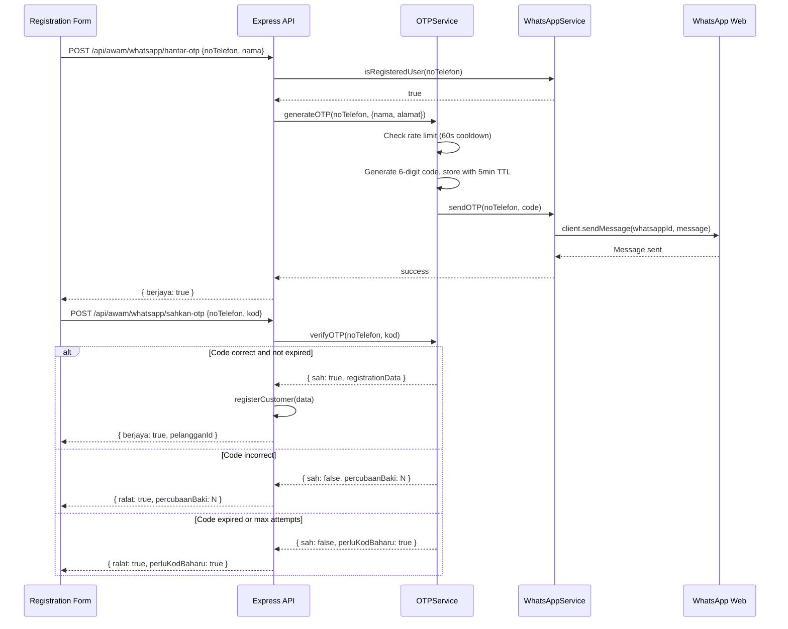
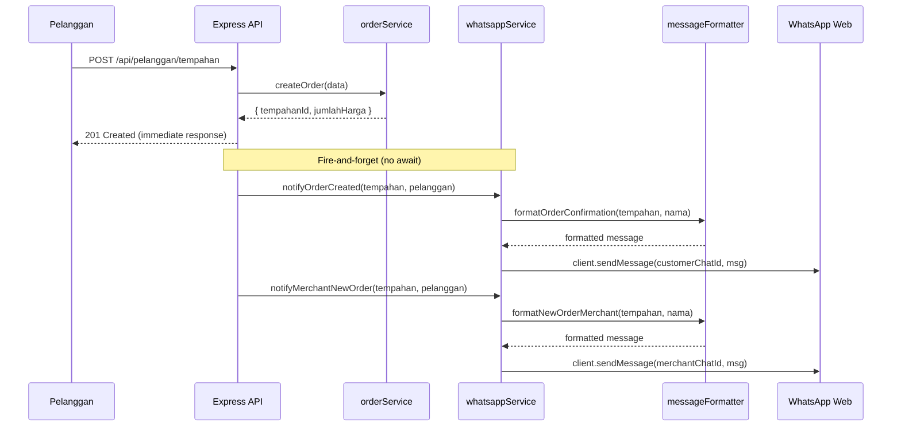

# Design Document: WhatsApp Integration

## Overview

This design describes the integration of WhatsApp messaging into the MyKek cake ordering system using the [whatsapp-web.js](https://docs.wwebjs.dev/) (wwebjs) library. The integration adds three major capabilities:

1. **Phone number verification via OTP** during customer registration
2. **Order lifecycle notifications** sent to customers and the merchant
3. **QR code-based session pairing** managed through the Peniaga admin panel

The architecture follows a singleton service pattern where a single wwebjs Client instance runs alongside the Express server. Messages are queued in-memory when the client is disconnected and flushed when connection is restored. The design prioritizes non-blocking, fire-and-forget messaging so that core order and auth flows are never delayed by WhatsApp operations.

### Key Design Decisions

| Decision | Rationale |
|----------|-----------|
| Singleton wwebjs Client | Only one WhatsApp Web session is allowed per phone number; a single instance avoids conflicts |
| In-memory message queue | Simpler than a persistent queue; acceptable given the 100-message cap and non-critical nature of notifications |
| LocalAuth strategy | Persists session to filesystem via `.wwebjs_auth/` directory, surviving server restarts without a database |
| QR exposed via polling endpoint | SSE or WebSocket would add complexity; polling every few seconds is adequate for a rarely-used pairing flow |
| In-memory OTP store | OTPs are short-lived (5 minutes), server restart invalidates them naturally, avoids DB migration complexity |
| Feature flag (WHATSAPP_ENABLED) | Allows the system to run without Puppeteer/Chromium in dev/test environments |
| Minimal API calls | Only essential messages are sent (registration OTP, order confirmation, order accepted/rejected/ready) |

### Technology Additions

| Layer | Technology | Purpose |
|-------|-----------|---------|
| Backend | `whatsapp-web.js` ^1.26.0 | WhatsApp Web client library |
| Backend | `qrcode` ^1.5.4 | QR code generation as data URL for frontend display |
| Frontend | New page `WhatsAppSettingsPage.jsx` | QR pairing interface for merchant |
| Backend | New service `whatsappService.js` | Core WhatsApp session + messaging logic |
| Backend | New service `otpService.js` | OTP generation, storage, validation |
| Backend | New route `peniaga/whatsapp.js` | WhatsApp admin endpoints |
| Backend | Extended route `public.js` | OTP verification endpoints (pre-auth) |

---

## Architecture



### WhatsApp Session Lifecycle



### OTP Verification Sequence



### Order Notification Flow



---

## Components and Interfaces

### New Files to Create

| File Path | Purpose |
|-----------|---------|
| `server/src/services/whatsappService.js` | Singleton WhatsApp client management, message sending, queue |
| `server/src/services/otpService.js` | OTP generation, validation, rate limiting |
| `server/src/utils/messageFormatter.js` | Message templates in Malay, currency/date formatting |
| `server/src/utils/phoneNumberUtil.js` | Phone number normalization to WhatsApp ID format |
| `server/src/routes/peniaga/whatsapp.js` | Merchant WhatsApp admin routes (status, QR) |
| `server/db/migrations/009_pelanggan_whatsapp.sql` | Add `noTelefonDisahkan` column |
| `client/src/pages/peniaga/WhatsAppSettingsPage.jsx` | QR code display + connection status UI |

### 1. WhatsApp Service (`server/src/services/whatsappService.js`)

The core singleton module managing the wwebjs Client lifecycle and message sending.

```javascript
// Connection states
export const CONNECTION_STATE = {
  CONNECTED: 'connected',
  DISCONNECTED: 'disconnected',
  QR_REQUIRED: 'qr_required',
  INITIALIZING: 'initializing',
};

/**
 * Initialize the WhatsApp client (called once at server startup).
 * Uses LocalAuth strategy for session persistence.
 * Listens for 'qr', 'ready', 'authenticated', 'disconnected' events.
 */
export async function initialize();

/** Get current connection status. */
export function getStatus();

/** Get the current QR code as a base64 data URL, or null. */
export function getQRCode();

/**
 * Send a WhatsApp message. Queues if disconnected.
 * @param {string} phoneNumber - Raw phone number (Malaysian format)
 * @param {string} message - Message content (max 4096 chars)
 * @returns {Promise<{ sent: boolean, queued: boolean, error?: string }>}
 */
export async function sendMessage(phoneNumber, message);

/**
 * Check if a phone number is registered on WhatsApp.
 * @param {string} phoneNumber - Raw phone number
 * @returns {Promise<boolean>}
 */
export async function isRegisteredUser(phoneNumber);

/**
 * Send OTP message for phone verification.
 * @param {string} phoneNumber - Target phone number
 * @param {string} code - 6-digit OTP code
 * @returns {Promise<{ sent: boolean, error?: string }>}
 */
export async function sendOTP(phoneNumber, code);

/** Notify customer of order confirmation (fire-and-forget, 1 retry). */
export function notifyOrderCreated(tempahan, pelanggan);

/** Notify merchant of new order (fire-and-forget, 1 retry). */
export function notifyMerchantNewOrder(tempahan, pelanggan);

/** Notify customer of status change (fire-and-forget, no retry). */
export function notifyStatusChange(tempahan, pelanggan);
```

### 2. OTP Service (`server/src/services/otpService.js`)

In-memory OTP management with rate limiting.

```javascript
/**
 * Generate and store a new OTP for a phone number.
 * Enforces 60-second cooldown between requests for same number.
 * @param {string} noTelefon - Normalized phone number
 * @param {object} registrationData - { nama, alamat } preserved during verification
 * @returns {{ berjaya: boolean, ralat?: string, tunggSaat?: number }}
 */
export function generateOTP(noTelefon, registrationData);

/**
 * Verify an OTP code for a phone number.
 * @param {string} noTelefon - Phone number
 * @param {string} kod - 6-digit code submitted by user
 * @returns {{ sah: boolean, ralat?: string, percubaanBaki?: number,
 *             registrationData?: object, perluKodBaharu?: boolean }}
 */
export function verifyOTP(noTelefon, kod);

/** Clean expired OTP entries (called every 10 minutes via setInterval). */
export function cleanExpired();
```

### 3. Phone Number Utility (`server/src/utils/phoneNumberUtil.js`)

Pure functions for phone number normalization and validation.

```javascript
/**
 * Normalize a Malaysian phone number to WhatsApp ID format.
 * 1. Strips all non-digit characters
 * 2. Converts leading "0" to "60"
 * 3. Validates length (10-15 digits) and prefix ("0" or "60")
 * 4. Appends "@c.us"
 * @param {string} phoneNumber - Raw input
 * @returns {{ valid: boolean, whatsappId?: string, error?: string }}
 */
export function toWhatsAppId(phoneNumber);

/**
 * Strip all non-digit characters from a string.
 * @param {string} input
 * @returns {string} Digits only
 */
export function stripNonDigits(input);
```

### 4. Message Formatter (`server/src/utils/messageFormatter.js`)

Pure functions building Malay-language notification messages.

```javascript
/** Format order confirmation message for customer. */
export function formatOrderConfirmation(tempahan, namaPelanggan);

/** Format new order notification for merchant. */
export function formatNewOrderMerchant(tempahan, namaPelanggan);

/** Format status change notification for customer. */
export function formatStatusChange(tempahan, namaPelanggan);

/** Format OTP verification message. */
export function formatOTPMessage(code, namaPelanggan);

/** Format currency as "RM X,XXX.XX". */
export function formatCurrency(amount);

/** Format date as "DD/MM/YYYY". */
export function formatDate(date);

/** Truncate message to 4096 chars preserving header. */
export function truncateMessage(message);
```

### 5. API Endpoints

#### Merchant WhatsApp Admin (`server/src/routes/peniaga/whatsapp.js`)

| Method | Endpoint | Auth | Description |
|--------|----------|------|-------------|
| GET | `/api/peniaga/whatsapp/status` | Peniaga | Get current connection status |
| GET | `/api/peniaga/whatsapp/qr` | Peniaga | Get QR code base64 data URL |

**GET /api/peniaga/whatsapp/status** Response:
```json
{
  "ralat": false,
  "data": {
    "status": "connected",
    "statusLabel": "Tersambung"
  }
}
```

Status mapping: `connected` → "Tersambung", `disconnected` → "Terputus", `qr_required` → "Menunggu Imbasan QR"

**GET /api/peniaga/whatsapp/qr** Response:
```json
{
  "ralat": false,
  "data": {
    "qr": "data:image/png;base64,iVBORw0KGgo...",
    "status": "qr_required"
  }
}
```

#### Public OTP Routes (added to `server/src/routes/public.js`)

| Method | Endpoint | Auth | Description |
|--------|----------|------|-------------|
| POST | `/api/awam/whatsapp/hantar-otp` | None | Send OTP to phone number |
| POST | `/api/awam/whatsapp/sahkan-otp` | None | Verify OTP and complete registration |

**POST /api/awam/whatsapp/hantar-otp**
```json
// Request
{ "noTelefon": "0121234567", "nama": "Ahmad bin Ali", "alamat": "123 Jalan Utama" }

// Success
{ "berjaya": true, "mesej": "Kod pengesahan telah dihantar ke WhatsApp anda." }

// Rate limited
{ "ralat": true, "mesej": "Sila tunggu 45 saat sebelum meminta kod baharu.", "tunggSaat": 45 }

// Not on WhatsApp
{ "ralat": true, "mesej": "Nombor ini tidak berdaftar di WhatsApp.", "medan": "noTelefon" }
```

**POST /api/awam/whatsapp/sahkan-otp**
```json
// Request
{ "noTelefon": "0121234567", "kod": "482915" }

// Success (registration completed)
{ "berjaya": true, "mesej": "Pendaftaran berjaya.", "pelangganId": "PLG0001" }

// Invalid code
{ "ralat": true, "mesej": "Kod pengesahan tidak sah.", "percubaanBaki": 2 }

// Expired
{ "ralat": true, "mesej": "Kod telah tamat tempoh. Sila minta kod baharu.", "perluKodBaharu": true }
```

### 6. Frontend Component: WhatsAppSettingsPage

```
Route: /peniaga/tetapan-whatsapp
Protected by: ProtectedRoute (peniaga role)

Displays:
- Current connection status badge (Tersambung/Terputus/Menunggu Imbasan QR)
- QR code image when status is qr_required (auto-refreshes every 60s)
- "Sambungan Berjaya" success message when QR is scanned
- Polls /api/peniaga/whatsapp/status every 5 seconds for state changes
```

### 7. Integration Points with Existing Code

| Integration Point | Change |
|------------------|--------|
| `server/src/index.js` | Call `whatsappService.initialize()` on startup if `WHATSAPP_ENABLED=true`; mount new routes |
| `server/src/routes/pelanggan/order.js` | After `createOrder()` succeeds, call `notifyOrderCreated()` and `notifyMerchantNewOrder()` (no await) |
| `server/src/routes/peniaga/order.js` | After `acceptOrder()`, `rejectOrder()`, `advanceStatus()` succeed, call `notifyStatusChange()` (no await) |
| `server/src/routes/public.js` | Mount OTP sub-routes under `/whatsapp/` |
| `client/src/App.jsx` | Add `/peniaga/tetapan-whatsapp` route |
| `client/src/components/MerchantLayout.jsx` | Add "WhatsApp" nav link |

---

## Data Models

### Database Schema Changes

```sql
-- server/db/migrations/009_pelanggan_whatsapp.sql
ALTER TABLE Pelanggan
  ADD COLUMN noTelefonDisahkan BOOLEAN NOT NULL DEFAULT FALSE;
```

Existing customers default to `FALSE`. Verification is enforced only for new registrations when `WHATSAPP_ENABLED=true`.

### In-Memory Data Structures

#### Message Queue

```javascript
/**
 * @typedef {Object} QueuedMessage
 * @property {string} whatsappId - Formatted chat ID (e.g., "60121234567@c.us")
 * @property {string} message - Message content
 * @property {number} queuedAt - Timestamp (Date.now())
 */

// Max size: 100 messages
// Processing order: FIFO (chronological)
// On reconnection failure: discard messages where (now - queuedAt) > 24 hours
// When full: reject new messages with error
```

#### OTP Store

```javascript
/**
 * @typedef {Object} OTPEntry
 * @property {string} code - 6-digit numeric code
 * @property {number} expiresAt - Date.now() + 300000 (5 minutes)
 * @property {number} attempts - Verification attempts used (starts 0, max 3)
 * @property {number} lastSentAt - Timestamp of generation (for rate limiting)
 * @property {object} registrationData - { nama, alamat }
 */

// Map<string(noTelefon), OTPEntry>
// Cleanup: setInterval every 10 minutes removes expired entries
```

### Environment Variables

```bash
# Added to server/.env
WHATSAPP_ENABLED=true                   # Master toggle for all WhatsApp features
WHATSAPP_SESSION_PATH=.wwebjs_auth      # Session persistence directory
WHATSAPP_PUPPETEER_ARGS=--no-sandbox    # Puppeteer launch args
```

### Message Templates

All messages follow: "MyKek" header → blank line → greeting → body.

**OTP Message:**
```
MyKek

Hai Ahmad,

Kod pengesahan anda ialah: 482915

Kod ini sah untuk 5 minit. Jangan kongsi kod ini dengan sesiapa.
```

**Order Confirmation (Customer):**
```
MyKek

Hai Ahmad,

Tempahan anda telah berjaya dihantar! 🎂

📋 No. Tempahan: TMP00042
📅 Tarikh Ambil: 15/01/2025
🚗 Kaedah: Ambil Sendiri
💰 Jumlah: RM 150.00
📌 Status: Menunggu Pengesahan

Kami akan maklumkan apabila tempahan anda diterima. Terima kasih!
```

**New Order (Merchant):**
```
MyKek

Tempahan Baharu! 🔔

📋 No. Tempahan: TMP00042
👤 Pelanggan: Ahmad
📅 Tarikh Ambil: 15/01/2025
💰 Jumlah: RM 150.00
🚗 Kaedah: Ambil Sendiri

Sila semak dan terima/tolak tempahan ini.
```

**Status: Diterima:**
```
MyKek

Hai Ahmad,

Tempahan anda (TMP00042) telah diterima! ✅

Peniaga akan mula menyediakan kek anda. Kami akan maklumkan apabila siap.
```

**Status: Ditolak:**
```
MyKek

Hai Ahmad,

Maaf, tempahan anda (TMP00042) tidak dapat diterima. ❌

Sebab: Tarikh yang dipilih sudah penuh.

Sila buat tempahan baharu dengan tarikh lain.
```

**Status: Siap (Ambil Sendiri):**
```
MyKek

Hai Ahmad,

Tempahan anda (TMP00042) sudah siap! 🎉

Sila datang untuk mengambil kek anda.
```

**Status: Siap (Penghantaran):**
```
MyKek

Hai Ahmad,

Tempahan anda (TMP00042) sudah siap! 🎉

Kek anda akan dihantar mengikut alamat yang diberikan.
```

---

## Correctness Properties

*A property is a characteristic or behavior that should hold true across all valid executions of a system — essentially, a formal statement about what the system should do. Properties serve as the bridge between human-readable specifications and machine-verifiable correctness guarantees.*

### Property 1: Message queue preserves chronological order and enforces capacity

*For any* sequence of messages enqueued while the WhatsApp client is disconnected, the queue SHALL maintain messages in chronological order (FIFO), SHALL never exceed 100 messages, and when at capacity SHALL reject new messages. After reconnection failure, only messages queued within the last 24 hours SHALL be retained, preserving their relative order.

**Validates: Requirements 1.5, 1.6, 1.7**

### Property 2: OTP generation produces valid 6-digit codes with correct expiry

*For any* invocation of OTP generation, the resulting code SHALL be a string of exactly 6 numeric digits (000000–999999) and the associated expiry timestamp SHALL be exactly 300,000 milliseconds after the generation time.

**Validates: Requirements 2.2**

### Property 3: OTP verification round-trip correctness

*For any* generated OTP entry that has not expired and has fewer than 3 attempts used, submitting the exact stored code SHALL result in successful verification. Submitting any different code SHALL fail, increment the attempt counter, and return the correct remaining attempts (3 − attempts − 1).

**Validates: Requirements 2.3, 2.4, 2.5**

### Property 4: OTP rate limiting enforces 60-second cooldown

*For any* phone number that received an OTP at time T, requesting a new OTP at any time T' where (T' − T) < 60 seconds SHALL be rejected with a remaining wait time of ⌈60 − (T' − T)/1000⌉ seconds.

**Validates: Requirements 2.6**

### Property 5: Phone number normalization for valid Malaysian numbers

*For any* input string containing a valid Malaysian phone number (10–15 digits after stripping non-digit characters, starting with "0" or "60"), `toWhatsAppId` SHALL strip all non-digit characters, replace a leading "0" with "60" (or keep existing "60"), and append "@c.us". The resulting WhatsApp ID SHALL match the pattern `/^60\d{8,13}@c\.us$/`.

**Validates: Requirements 7.1, 7.2, 7.3**

### Property 6: Invalid phone numbers are rejected without exceptions

*For any* input that, after stripping non-digit characters, has fewer than 10 digits, more than 15 digits, or does not start with "0" or "60", `toWhatsAppId` SHALL return `{ valid: false }` with an error string and SHALL NOT throw an exception.

**Validates: Requirements 7.4, 7.5**

### Property 7: Order confirmation message contains all required fields

*For any* valid Tempahan (tempahanId, tarikhAmbil, kaedahPenghantaran, jumlahHarga, statusTempahan) and any customer name, the formatted order confirmation SHALL contain: tempahanId verbatim, tarikhAmbil in DD/MM/YYYY format, kaedahPenghantaran, jumlahHarga in "RM X,XXX.XX" format, statusTempahan, the "MyKek" header, and "Hai [name],".

**Validates: Requirements 3.2, 6.2, 6.6**

### Property 8: Merchant notification message contains all required fields

*For any* valid Tempahan and customer name, the formatted merchant notification SHALL contain: tempahanId, customer name, tarikhAmbil in DD/MM/YYYY format, jumlahHarga in "RM X,XXX.XX" format, kaedahPenghantaran, and the "MyKek" header.

**Validates: Requirements 4.2, 6.2**

### Property 9: Status notifications are only sent for qualifying statuses with correct content

*For any* status value from {"Menunggu Pengesahan", "Diterima", "Ditolak", "Dibatalkan", "Sedang Dibuat", "Siap", "Selesai"}, a notification SHALL be generated if and only if the status is in {"Diterima", "Ditolak", "Siap"}. For "Ditolak" with null/empty sebabTolak, the message SHALL include default text. For "Siap", the message SHALL indicate pickup or delivery based on kaedahPenghantaran.

**Validates: Requirements 5.1, 5.2, 5.3, 5.4, 5.5**

### Property 10: Currency formatting produces valid RM format

*For any* non-negative number, `formatCurrency` SHALL produce a string matching "RM " followed by digits grouped by thousands with commas and exactly 2 decimal places. Parsing the numeric portion back SHALL equal the input rounded to 2 decimal places.

**Validates: Requirements 6.3**

### Property 11: Date formatting produces DD/MM/YYYY

*For any* valid Date object, `formatDate` SHALL produce a string matching the pattern DD/MM/YYYY with zero-padded day (01–31) and month (01–12), representing the same calendar day as the input.

**Validates: Requirements 6.4**

### Property 12: Message truncation preserves header within 4096-char limit

*For any* message string, if it exceeds 4,096 characters, the output SHALL be at most 4,096 characters while preserving the "MyKek\n\n" header. Messages at or under 4,096 characters SHALL be unchanged.

**Validates: Requirements 6.5**

### Property 13: All customer-facing messages include header and personalized greeting

*For any* valid inputs to customer-facing formatter functions (formatOrderConfirmation, formatStatusChange, formatOTPMessage), the output SHALL start with "MyKek\n\n" and contain "Hai [name]," where [name] is the provided customer name.

**Validates: Requirements 6.2, 6.6**

---

## Error Handling

### WhatsApp Service Errors

| Scenario | Handling | User Impact |
|----------|----------|-------------|
| wwebjs Client fails to initialize | Log error, set state to `disconnected`, continue startup | No WhatsApp features; order/auth flows work normally |
| Message send fails (order/merchant) | Log, retry once after 5s. If retry fails, discard. | Customer/merchant may not receive notification |
| Message send fails (status update) | Log with tempahanId, no retry | Customer doesn't receive status update |
| QR generation timeout | Return null QR, frontend shows retry message | Peniaga refreshes page |
| Reconnection fails (3 attempts) | Set `disconnected`, discard messages > 24h old | Peniaga must re-scan QR |
| Queue full (100 messages) | Reject new message, log overflow | Message lost |
| Puppeteer browser crashes | Attempt destroy + reinitialize client | Temporary service outage |

### OTP Errors

| Scenario | Response |
|----------|----------|
| WhatsApp disconnected during OTP | `{ ralat: true, mesej: "Perkhidmatan WhatsApp tidak tersedia." }` |
| Phone not on WhatsApp | `{ ralat: true, mesej: "Nombor ini tidak berdaftar di WhatsApp.", medan: "noTelefon" }` |
| Rate limited (< 60s) | `{ ralat: true, mesej: "Sila tunggu X saat...", tunggSaat: N }` |
| Invalid OTP code | `{ ralat: true, mesej: "Kod pengesahan tidak sah.", percubaanBaki: N }` |
| OTP expired / max attempts | `{ ralat: true, mesej: "Kod telah tamat tempoh.", perluKodBaharu: true }` |
| Duplicate phone registration | `{ ralat: true, mesej: "Nombor telefon sudah didaftarkan." }` |

### Error Codes

```javascript
export const WA_ERROR_CODES = {
  WHATSAPP_TIDAK_TERSEDIA: 'WHATSAPP_TIDAK_TERSEDIA',
  NOMBOR_TIDAK_WHATSAPP: 'NOMBOR_TIDAK_WHATSAPP',
  OTP_TAMAT_TEMPOH: 'OTP_TAMAT_TEMPOH',
  OTP_TIDAK_SAH: 'OTP_TIDAK_SAH',
  OTP_TERHAD: 'OTP_TERHAD',
  GILIRAN_PENUH: 'GILIRAN_PENUH',
};
```

### Graceful Degradation

When `WHATSAPP_ENABLED=false` or client is disconnected:
- Order creation continues normally (notifications silently skipped)
- Registration falls back to direct flow (no OTP required)
- Merchant dashboard functions normally
- WhatsApp admin endpoints still return status ("Terputus")

---

## Testing Strategy

### Testing Framework

| Layer | Framework | Purpose |
|-------|-----------|---------|
| Unit Tests | Vitest | Pure logic: formatters, phone utils, OTP, queue |
| Property Tests | fast-check (via Vitest) | Universal properties across random inputs |
| Integration Tests | Vitest + Supertest | API endpoints with mocked wwebjs client |
| Component Tests | Vitest + React Testing Library | WhatsApp settings page UI |

### Property-Based Testing Configuration

- **Library**: fast-check (already in server devDependencies v3.22.0)
- **Runner**: Vitest (already configured)
- **Minimum iterations**: 100 per property test
- **Tag format**: `Feature: whatsapp-integration, Property {number}: {description}`

### Test Categories

#### Property-Based Tests (fast-check + Vitest)

| Property | Module Under Test | Key Arbitraries |
|----------|-------------------|-----------------|
| 1 | messageQueue.js | Random arrays of 0–150 messages with random timestamps |
| 2 | otpService.js | Multiple generation invocations |
| 3 | otpService.js | Random codes, expiry times, attempt counts |
| 4 | otpService.js | Random timestamps within 0–120s of last request |
| 5 | phoneNumberUtil.js | Random strings with digits + special characters (valid prefix/length) |
| 6 | phoneNumberUtil.js | Short/long digit strings, wrong prefixes |
| 7 | messageFormatter.js | Random Tempahan objects + random names |
| 8 | messageFormatter.js | Random Tempahan + random Pelanggan names |
| 9 | messageFormatter.js | All 7 status values × random order data |
| 10 | messageFormatter.js | Random floats (0.00–999999.99) |
| 11 | messageFormatter.js | Random valid Dates (2020–2030) |
| 12 | messageFormatter.js | Random strings of 1–10000 chars |
| 13 | messageFormatter.js | Random names × all customer-facing formatters |

#### Unit Tests (Vitest)

- Session initialization event handling (mocked wwebjs Client)
- Reconnection: 3 attempts × 10s intervals, failure behavior
- Queue: full rejection, flush order, age-based pruning
- OTP: concurrent requests for same number, cleanup timer
- Feature flag: `WHATSAPP_ENABLED=false` bypasses all sends
- Merchant notification: skipped when `noTelefonKedai` is null/empty
- Status notifications: no retry on failure (unlike order notifications)

#### Integration Tests (Vitest + Supertest)

- `POST /api/awam/whatsapp/hantar-otp` — success, rate limited, duplicate, not on WhatsApp
- `POST /api/awam/whatsapp/sahkan-otp` — correct code, incorrect, expired
- `GET /api/peniaga/whatsapp/status` — auth guard (401), correct status response
- `GET /api/peniaga/whatsapp/qr` — auth guard, returns QR or null
- Order creation triggers async customer + merchant notification
- Status change triggers notification only for Diterima/Ditolak/Siap

#### Component Tests (React Testing Library)

- `WhatsAppSettingsPage`: Renders correct Malay status labels
- `WhatsAppSettingsPage`: Shows QR image when `qr_required`
- `WhatsAppSettingsPage`: "Sambungan Berjaya" on status → connected
- `WhatsAppSettingsPage`: Polling intervals (5s status, 60s QR)
- Registration form: 2-step OTP flow UI interaction
